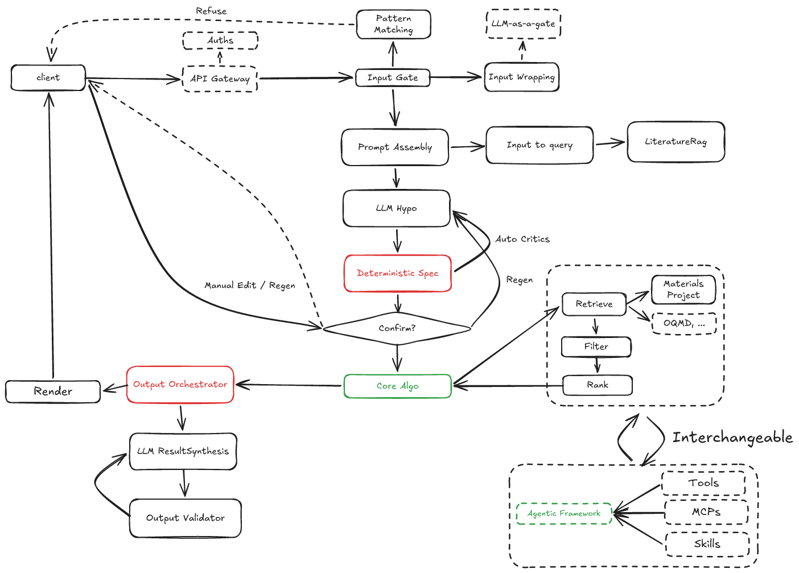
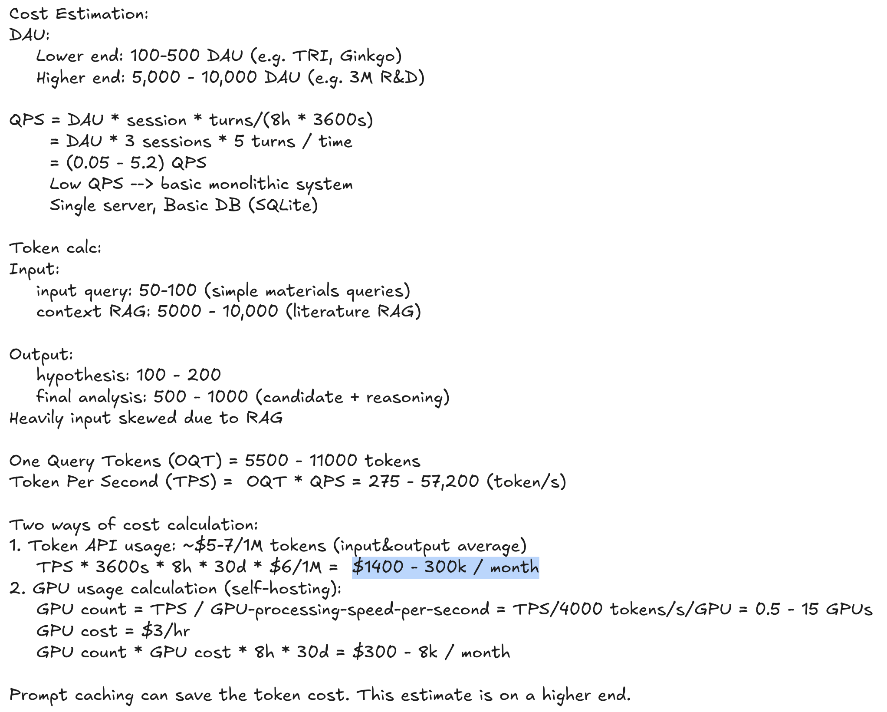

# Materials-Triage — Design Note

*A Small Deployable Agentic Assistant for a Materials Science Research Center.*

---

## 1. Problem & what it does

A scientist asks, in natural language, for candidate materials ("a non-toxic oxide with high
bulk modulus, simple composition"). Materials-Triage returns a **ranked, fully-cited shortlist**
of real candidates from public databases, with caveats and clearly-marked missing/uncertain
data, in two views:

- **PI summary** — concise, decision-ready.
- **Audit view** — the full technical trace: every number, its provenance, every filter drop,
  every ranking score, every cited claim.

It is **public-data-only by construction**: no wet-lab actions, no private-lab reads, no
paywalled scraping. It resists basic prompt injection because retrieved text is treated as
untrusted DATA, never instructions.

---

## 2. Requirements (FR / NFR)

These requirements are the starting point; every design decision in the rest of this note traces
back to one of them.

**Functional**

| # | Requirement | How it's met | Status |
|---|---|---|---|
| FR1 | Triage candidate materials before experiments | the full 9-step pipeline → pre-experiment ranked shortlist | ✅ |
| FR2 | Single-modal input (text) | NL goal via CLI / `chat` REPL | ✅ |
| FR3 | Single-modal output (text) | plain-text renderers (`render.py`) | ✅ |
| FR3.1 | Ranked shortlist + rationale, caveats, missing/uncertain data | ranking + cited synthesis + first-class missing-data flags | ✅ |
| FR3.2 | ≥2 response styles (PI summary / audit) | `render_run(view="pi"\|"audit")` | ✅ |
| FR4 | No wet-lab / private data / closed / paywalled sources | capability-by-construction — no such tool exists; input gate guarding against malicious behavior | ✅ |
| FR5 | Can access public sources | Materials Project adapter; OpenAlex/Crossref RAG | ✅ |
| FR6 | Personal assistance | lab memory remembers saved specs → zero-setup personalization | ✅ |

**Non-functional**

| # | Requirement | How it's met | Status |
|---|---|---|---|
| NFR1 | **Useful** — generate hypotheses + candidate materials | hypothesis layer + deterministic retrieve/rank | ✅ |
| NFR2 | **Honest** — candidates from real data, not LLM text | output validator | ✅ |
| NFR3 | **Traceable** — every step's I/O saved & accessible | `TriageRun` trace + audit view ‹durable SQLite store: in progress› | ◐ |
| NFR4 | **Configurable** — models, temperature, view, hypothesis | ranking method + view + model selectable (effort level); hypothesis editable via spec gate | ◐ |
| NFR5 | **Robust** — I/O guardrails, retries, scalable | input gate + output validator + retry/degrade | ◐ |
---

## 3. Design decision

**The LLM never invents scientific facts.** Public databases supply every number (tagged with
source + method); deterministic code filters and ranks; the LLM only (a) builds the spec, (b) proposes
hypotheses, and (c) writes grounded, cited narrative. An output validator rejects any
non-resolvable ID or citation.

---

## 4. Workflow

A 7-step LangGraph graph with a checkpointer and one human-in-the-loop interrupt:

1. **Input policy gate** — deterministic, allowlist-first scope check + forbidden-action
   denylist. Out-of-scope/forbidden → output refusal with a capabilities redirect.
2. **Prompt Assembly (LLM + RAG)** - input query -> search query -> RAG
3. **Hypothesis (LLMs)** — propose candidates / property ranges based on literature. Missing fields filled by a
   recommend-LLM seeded by defaults + lab memory. A deterministic **fidelity gate**
   (`reconcile_spec`) re-seeds hard facets the LLM dropped (oxide→require O, non-toxic→exclude
   toxic elements, simple→element-count cap). A ranking critic (LLM) prunes off-goal/redundant objectives (best-effort, soft-degrades).
4. **Spec building (LLMs + human)** — LLM Hypothesis → `TriageSpec` → **human confirms** → Final Spec.
5. **Core Algo** - Deterministic workflow based on TriageSpec. Maximize usefulness and honesty
   1. **Retrieve (code, not LLM)** — deterministic API calls; **v1: Materials Project only.**
      Returns candidates + `PropertyValue`s, each carrying `Provenance`.
   2. **Hard filters** — drop any candidate violating any hard constraint; each drop records a reason.
   3. **Ranking** — `geometric_mean` or `arithmetic_mean`. Applies `on_missing` and flags missing data.
6. **Synthesis (LLM + RAG)** — grounded narrative + mechanistic why
   1. **Output validator** — every referenced ID + citation must resolve to retrieved provenance; ungrounded → reject & retry (or degrade with a caveat).
7.  **Render** — `view=pi` or `view=audit`.

---

## 5. Key decisions & deliberate scope cuts

- **Materials Project only (v1).** DFT values are XC-functional-dependent and *not cross-functional
  rankable*, so naïvely merging MP + OQMD would rank apples against oranges. Cross-source merge is
  deferred until a functional-aware retrieval strategy exists — a correctness decision, not a time cut.
- **Input gate is deliberately the *weakest* of five safety layers.** Real safety is
  capability-by-construction (no dangerous tool exists), the trust boundary, per-node least
  privilege, and the output validator. The deterministic gate is cheap triage, right-sized as such.
- **Deterministic ranking, not LLM ranking.** A weighted geometric mean of
  Derringer–Suich desirabilities means one failed target zeros the candidate, exactly the
  behavior a scientist wants, and impossible to get reliably from an LLM scoring pass.

---

## 6. Robustness, traceability, configurability

**Traceability** is already structural: each run exports a `TriageRun` carrying candidates,
property values, provenance, every filter/rank drop, synthesis narrative, and retrieved
literature — the audit view reads it all from one object.

**Failure taxonomy** — four classes, each handled differently:

| # | Class | Failure | Handling |
|---|---|---|---|
| 1 | **Infra** | Transient external — Bedrock 429/5xx, MP/OpenAlex timeout, network blip | bounded exponential backoff + jitter, capped attempts |
| 2 | **Application** | Crash / process death / unhandled exception in our orchestration | checkpointer → re-enter at last incomplete step (status marker) |
| 3 | **Model** | Malformed / non-conformant LLM output (~15% measured; fabricated IDs) | validate → retry the call → **degrade (omit + caveat), never hard-fail** |
| 4 | **Quality** | Valid run, degenerate result — 0 candidates after filters, all-missing data | **not a retry** — surface as a loud caveat |

---

## 7. Token Usage & Cost Estimation

---

## 8. v2 roadmap

- Cross-source retrieval, functional-first: decide XC functional at hypothesis → fetch by
  `run_type` → fall back if sparse.
- LLM-hybrid input scope check.
- Richer RAG tokenizer: case-folding `Co`≠`CO`, synonymy `TiO2`≡"titanium dioxide", stemming.
- Agentic Core: swap the Retrieve-Filter-Rank core with agentic framework for better flexibility and capability. 

---

### Appendix: repo map

Package root: `src/materials_triage/`. Heavy deps (`langchain-aws`, `requests`) live only at the
edges (`agent/`, `sources/`); `core/` stays pure and offline-testable.

- `core/` — domain models + deterministic logic, no heavy deps
  - domain models: `schema.py`, `elements.py`, `hypothesis.py`
  - deterministic functions: `scoring.py`, `ranking.py`
  - fidelity gate: `fidelity.py`
  - critic: `critique.py`
  - output synthesis: `synthesis.py`
  - trace export: `run_trace.py`
- `agent/` — the LLM seam (Claude on Bedrock; mockable for offline eval)
  - `llm.py` — Hypothesis / Synthesis providers + `RankingCritic` (also `extract_keywords` for RAG)
  - `prompts.py` — system prompts + message builders (trusted instructions vs. untrusted-DATA fencing)
  - `validator.py` — output validator (every ID/citation must resolve to retrieved provenance)
  - `orchestrator.py` — LangGraph graph + checkpointer
  - `serde.py` — checkpointer (de)serialization allowlist for domain models
- `policy/` — `guardrails.py`: input gate (allowlist scope check + forbidden denylist) + trust-boundary wrapper
- `retrieval/` — `rag.py`: BM25 literature RAG over OpenAlex/Crossref abstracts
- `memory/` — `store.py`: lab memory (saved specs)
- `sources/` — pluggable retrieval backends (deterministic, never the LLM)
  - `base.py` — `SourceAdapter` interface
  - `materials_project.py` — MP adapter (server-side filter push + local routing, provenance-tagged)
  - `_mp_fields.py` — generated MP field/param vocabulary (units, descriptions, rankability, pushable params)
  - `stubs.py` — deferred sources as refusing stubs (multi-source design demonstrable; v1 = MP only)
- top level — `cli.py` (CLI), `chat.py` (chat REPL), `render.py` (PI / audit renderers), `doctor.py` (credential/env self-check)
